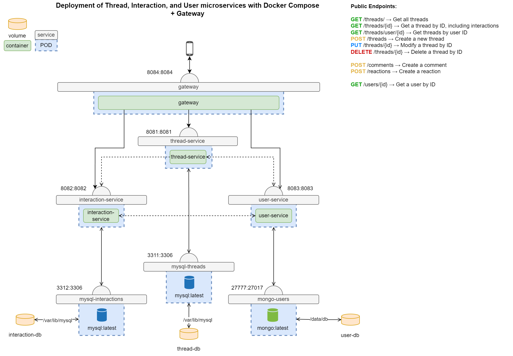

# Advanced Programming Topics - Project

## Theme

I have chosen to build my project around the theme of a forum, complete with threads, comments, reactions, and users.
Logged-in users can create threads, and leave comments or reactions on them. They can also get achievements in doing so.

## Components

This project contains 3 microservices:
1. [Thread Service](thread-service)
2. [Interaction Service](interaction-service) *(Implemented in Kotlin)*
3. [User Service](user-service)

These microservices are publicly accessible through the [gateway](gateway) service.

Some shared code, like the DTOs, is kept in a [Common](common) project, which is imported by all microservices.

> [!WARNING]  
> IntelliJ is sometimes unable to resolve the references to the Common project in the Interaction Service.
> This can be fixed by applying the quick fix it suggests: `Add dependency on module '….common.main'`. The project will compile regardless.

### Databases

The Thread- and Interaction Services both make use of a MySQL database, as their data is fairly structured.  
The User Service uses a MongoDB database instead, which allows it to store less structured data, like a list of achievements for example.
This also opens up the possibility to add more dynamic features to user profiles, like social links, badges, etc.

### Tests

I've written unit tests for all services relating to an entity in the database:
- [ThreadService](thread-service/src/test/java/me/maartenmarx/threadservice/ThreadServiceUnitTest.java)
- [CommentService & ReactionService](interaction-service/src/test/java/me/maartenmarx/interactionservice/InteractionServiceUnitTest.java)
- [UserService](user-service/src/test/java/me/maartenmarx/userservice/UserServiceUnitTest.java)

> [!NOTE]  
> I've not written any tests for the [`AchievementService`](user-service/src/main/java/me/maartenmarx/userservice/service/AchievementService.java) class,
> as I didn't consider it on the same level as the other services. Its methods also don't return any meaningful data, they only update an entry in the user database.

### Additional Features

- [x] **2.5** Add an event-driven service using a message broker
  - [x] **2.5.1** Use Kafka as a message broker

## Diagram

*(This image can be imported and edited on [draw.io](https://draw.io))*
